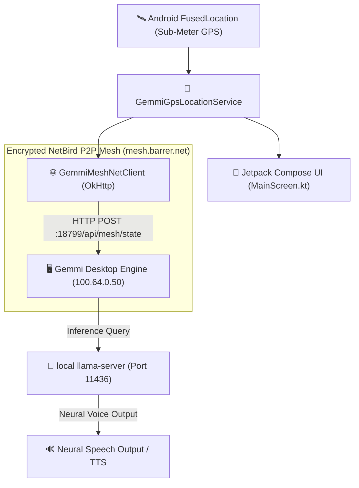

# ⬡ Gemmi Mobile Client (`gemmi-android`)

> **Autonomous Ambient AI Tour Guide & Sub-Meter GPS Mesh Node**  
> Dedicated Android client for the sovereign **Gemmi Second Brain Engine** & **Deep Horizon Hardware Ecosystem**.

---

## 🌟 Overview

`gemmi-android` is a native Android application built with **Kotlin** and **Jetpack Compose**. It turns your mobile device into a sovereign ambient node in the **Gemmi Ecosystem**. 

Whether roaming outdoors or working in the lab, `gemmi-android` streams live high-precision sub-meter GPS data, spatial bearing, and voice/camera telemetry back to your desktop **Gemmi Engine** (`100.64.0.50`) over a private **NetBird P2P Overlay Mesh** (`mesh.barrer.net`).

---

## 🚀 Key Features

- 🛰️ **Sub-Meter Fused GPS & Spatial Bearing**: Utilizes Google `play-services-location` `FusedLocationProviderClient` for high-frequency location updates, speed calculation, and landmark detection.
- 🎙️ **Ambient VAD & Tour Guide Narration**: Integrates continuous voice activity detection (VAD) and provides real-time AI audio tour guide narration as you pass regional landmarks.
- 🌐 **NetBird P2P Mesh Sync (`mesh.barrer.net`)**: Encrypted P2P state hydration directly to Gemmi Desktop (`100.64.0.50:18799`) with sub-300ms latency.
- 🤖 **Local LLM Interop (Port 11436)**: Seamlessly routes mobile queries to your local GGUF `llama-server` for private AI reasoning without cloud latency or subscription fees.
- 🎨 **Cyberpunk Dark Glassmorphism UI**: Designed with Jetpack Compose Material 3 featuring real-time telemetry meters, location status indicators, and interactive logs.

---

## 🏗️ Architectural Topology



---

## 📂 Project Structure

```
gemmi-android/
├── app/
│   ├── src/main/
│   │   ├── AndroidManifest.xml              # GPS, Camera, Mic & Network Permissions
│   │   └── java/com/example/gemmimobileclient/
│   │       ├── MainActivity.kt               # Entrypoint ComponentActivity
│   │       ├── service/
│   │       │   └── GemmiServices.kt          # GemmiGpsLocationService & GemmiMeshNetClient
│   │       ├── ui/
│   │       │   └── main/
│   │       │       └── MainScreen.kt         # 3-Tab Jetpack Compose Mobile Interface
│   │       └── theme/
│   │           └── Color.kt & Theme.kt       # Cyberpunk Dark Theme Palette
│   └── build.gradle.kts                      # Dependencies (play-services-location, okhttp, compose)
├── build.gradle.kts
└── README.md
```

---

## 🛠️ Building & Installation

### Prerequisites
- **Android Studio** (Ladybug or newer) or **Command Line Tools**
- **JDK 17** or **JDK 21**
- **Android SDK Platform 35**

### Build Debug APK via CLI
```bash
# Clone the repository
git clone https://github.com/ash-forge/gemmi-android.git
cd gemmi-android

# Compile Debug APK
.\gradlew.bat assembleDebug
```

The output APK will be located at:
```
app/build/outputs/apk/debug/app-debug.apk
```

### Install onto Device via ADB
```bash
adb install -r app/build/outputs/apk/debug/app-debug.apk
```

---

## 📜 License & Copyright

**Barrer Software © 2026** — Sovereign Ambient AI Systems  
*Part of the Deep Horizon & Gemmi Ecosystem.*
